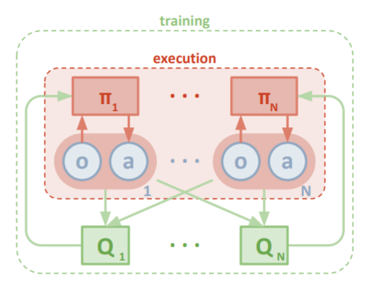
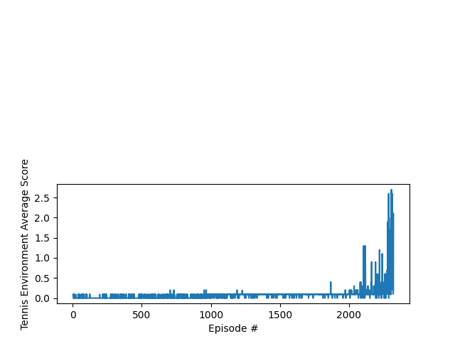
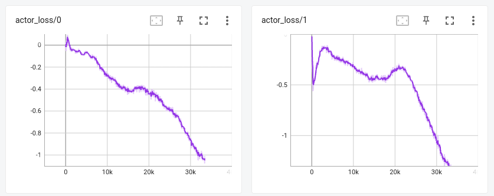
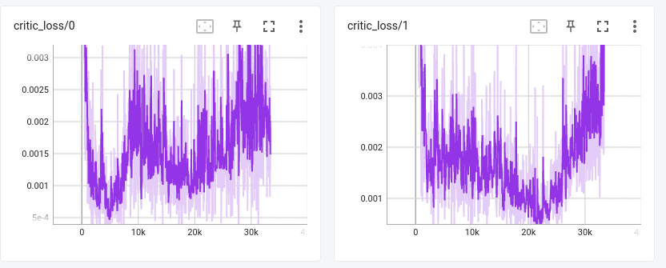

[//]: # (Image References)

[image1]: https://user-images.githubusercontent.com/10624937/42135623-e770e354-7d12-11e8-998d-29fc74429ca2.gif "Trained Agent"

# Introduction

For this project, The goal is to train a pair of collobarating agents using the tennis environment, one of the Unity environments described here: [Tennis](https://github.com/Unity-Technologies/ml-agents/blob/master/docs/Learning-Environment-Examples.md#tennis) environment. 

![Trained Agent][image1]

In this environment, two agents control rackets to bounce a ball over a net. If an agent hits the ball over the net, it receives a reward of +0.1.  If an agent lets a ball hit the ground or hits the ball out of bounds, it receives a reward of -0.01.  Thus, the goal of each agent is to keep the ball in play.

The observation space consists of 8 x 3 variables corresponding to the position and velocity of the ball and racket. Each agent receives its own, local observation.  Two continuous actions are available, corresponding to movement toward (or away from) the net, and jumping. 

The task is episodic, and in order to solve the environment, the agents must get an average score of +0.5 (over 100 consecutive episodes, after taking the maximum over both agents). Specifically,

- After each episode, we add up the rewards that each agent received (without discounting), to get a score for each agent. This yields 2 (potentially different) scores. We then take the maximum of these 2 scores.
- This yields a single **score** for each episode.

The environment is considered solved, when the average (over 100 episodes) of those **scores** is at least +0.5.

# Learning Algorithm

The algorithm implemented for solving the tennis environment is based on the MADDPG paper by Lowe et al. [Paper](https://arxiv.org/abs/1706.02275v4). MADDPG addresses environments where there are multiple agents either compiting or collaborating, or even both. In the case of the present Tennis environment there are two agents that needs to collaborate to keep hitting the ball for as long as possible. 

MADDPG paper main idea consists of having a centralized training, where each policy can use information from the rest of the agents, and decentralized execution, where each agent only uses information from its own agent. This naturally leads to use actor-critic algorithms, where agent critics can be trained using observations and actions from both agents, and the agent actors are trained and act using only own observation. 

This picture from the paper is a summary of this idea: 

In principle any actor critic algorithm could be adapted to use this framework, but in the paper [DDPG](https://arxiv.org/abs/1509.02971) is used. As a reminder, this is an off-policy algorithm suitable when the environment has a continuous action space, because the actor learns a policy aproximator to select the best action, and it has a replay buffer like in DQN algorihm to train both the critic and the agent.

I tried first with a vanilla replay buffer, but to improve the results I also implemented a [Prioritized Experience Replay buffer](https://arxiv.org/abs/1511.05952), where experiences that led to better learning are sampled more frequently.

## Neural Network Model Architecture

The Actor architecture has two hidden layers and the input and output layers, the number of features of each hidden layer is taken from the hyper parameters yaml file.
The activation Tanh function in the end ensures that the output domain is [-1, 1].

```
Actor(                                                                                                                            
  (model): Sequential(                                                                                                            
    (0): Linear(in_features=24, out_features=128, bias=True)                                                                      
    (1): SELU()                                                                                                                   
    (2): BatchNorm1d(128, eps=1e-05, momentum=0.1, affine=True, track_running_stats=True)                                         
    (3): Linear(in_features=128, out_features=64, bias=True)                                                                      
    (4): SELU()                                                                                                                   
    (5): Linear(in_features=64, out_features=32, bias=True)                                                                       
    (6): SELU()                                                                                                                   
    (7): Linear(in_features=32, out_features=2, bias=True)                                                                        
    (8): Tanh()                                                                                                                   
  )                                                                                                                               
)    
```

SELU activation is used instead of ReLU which has better properties and it is more smooth. Also there is a  batch normalization layer after the input layer to improve learning.

Another thing improved in the neural network from the last project is to init weights of the NN using xavier uniform initialization.


The Critic network has two branches, the first one is the observation branch (obs_net), and the other is the action input, both are joined in a common branch (q_net) which has two more hidden layers. As before, the number of features of each hidden layer is taken from the hyper parameters yaml file. There is no activation function at the end, as usual for value function aproximation.

In this case the input needs observation and actions of both agents, so it is the double of the actor input.

```
Critic(                                                                                                                           
  (obs_net): Sequential(                                                                                                          
    (0): Linear(in_features=48, out_features=128, bias=True)                                                                      
    (1): SELU()                                                                                                                   
    (2): BatchNorm1d(128, eps=1e-05, momentum=0.1, affine=True, track_running_stats=True)                                         
  )                                                                                                                               
  (q_net): Sequential(                                                                                                            
    (0): Linear(in_features=132, out_features=64, bias=True)                                                                      
    (1): SELU()                                                                                                                   
    (2): BatchNorm1d(64, eps=1e-05, momentum=0.1, affine=True, track_running_stats=True)                                          
    (3): Linear(in_features=64, out_features=32, bias=True)                                                                       
    (4): SELU()                                                                                                                   
    (5): Linear(in_features=32, out_features=1, bias=True)                                                                        
  )                                                                                                                               
)   
```

As with DQN, both actor and critic networks are duplicated in target networks, and local networks. The Local networks are used for training, and the target networks to produce stable targets to train previous networks. Every train step the target networks weights are "soft" updated with the local network weights. This is to have stable targets in the training, so it can converge. 


The loss function to optimize the critic network is a mean square error. The target actor and critic networks are used to compute future rewards. Critic input requires observation and actions of both agents.

```
target = rewards + gamma * self.critic_target(all_next_states, all_target_next_actions) * (1 - dones)                     
critic_loss_diff = F.mse_loss(self.critic_local(all_states,all_actions), target.detach(), reduction='none') * weights.uns\
queeze(dim=1)                                                                                                                     
critic_loss = critic_loss_diff.mean()               
```

The loss function of the actor network is simply the value function, negated to maximize it in the optimization step:

```
 actor_loss = -self.critic_local(all_states, all_local_actions).mean()    
```

The optimizer used in both networks is the Adam optimizer with a learning rate that is taken from the parameters yaml file.


## Hyper Parameters

The hyper parameters used in the final training loop are stored in the parameters.yaml file:

```
BUFFER_SIZE : 1000000    # replay buffer size.                                                                            
BATCH_SIZE : 256         # minibatch size                                                                                 
GAMMA : 0.99             # discount factor                                                                                
TAU : 0.01               # for soft update of target parameters                                                           
ACTOR_LR : 0.001         # learning rate for Actor network                                                                
ACTOR_HIDDEN_1: 128      # Number of features of hidden layer 1 of Actor NN                                               
ACTOR_HIDDEN_2: 64       # Number of features of hidden layer 2 of Actor NN                                               
ACTOR_HIDDEN_3: 32       # Number of features of hidden layer 3 of Actor NN                                               
CRITIC_LR : 0.001        # learning rate for Critic network                                                               
CRITIC_OBS_HIDDEN_1: 128 # Number of features of hidden layer 1 of Critic NN (observation branch)                         
CRITIC_HIDDEN_2: 64      # Number of features of hidden layer 2 of Critic NN (common branch)                              
CRITIC_HIDDEN_3: 32      # Number of features of hidden layer 3 of Critic NN (common branch)                              
SIGMA: 0.01              # noise generator sigma parameter                                                                
THETA: 0.15              # noise generator theta parameter                                                                
UPDATE_EVERY : 10        # how often to update the network                                                                
K : 4                    # times to train each update                                                                     
OUT_SCALE : 1.0          # scale of actions domain. In this case actions are [-1,1]        
```

## Plot of rewards 

This is the average plot rewards using the prioritized experience replay



Using the Prioritized Experience Replay the environment is solved in 2322 episodes: 

```
Episode 2100    Average Score: 0.11     Max score: 0.40                                                                           
Episode 2200    Average Score: 0.20     Max score: 1.30                                                                           
Episode 2300    Average Score: 0.34     Max score: 2.60                                                                           
Episode 2322    Average Score: 0.51     Max score: 2.70                                                                           
Environment solved in 2322 episodes!    Average Score: 0.51     Max score: 2.70   

```

These are the losses plot of both agents for actor and critic networks:






### Future ideas
In the future I think I would like to explore some ideas from curiosity-driven exploration in this paper: [paper](https://arxiv.org/abs/1705.05363), because in this environment the rewards are very sparse, and takes a long time for the agents to start learning a policy, even with the prioritized experience replay. As seen in the rewards plot, it takes 2000 episodes to start having some improvements.
